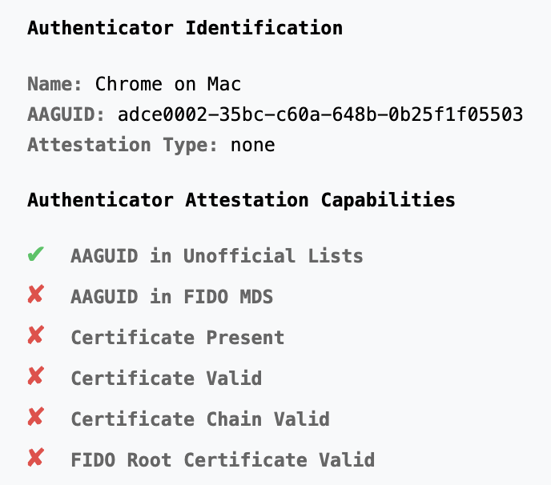
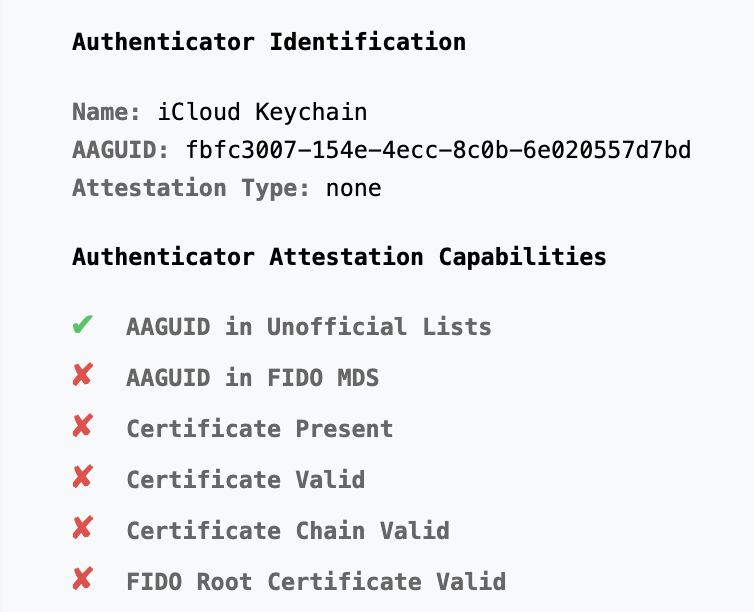
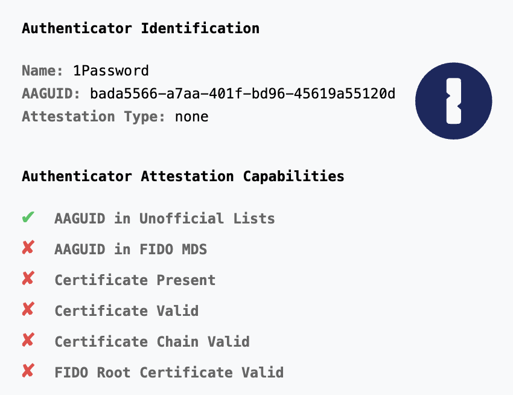
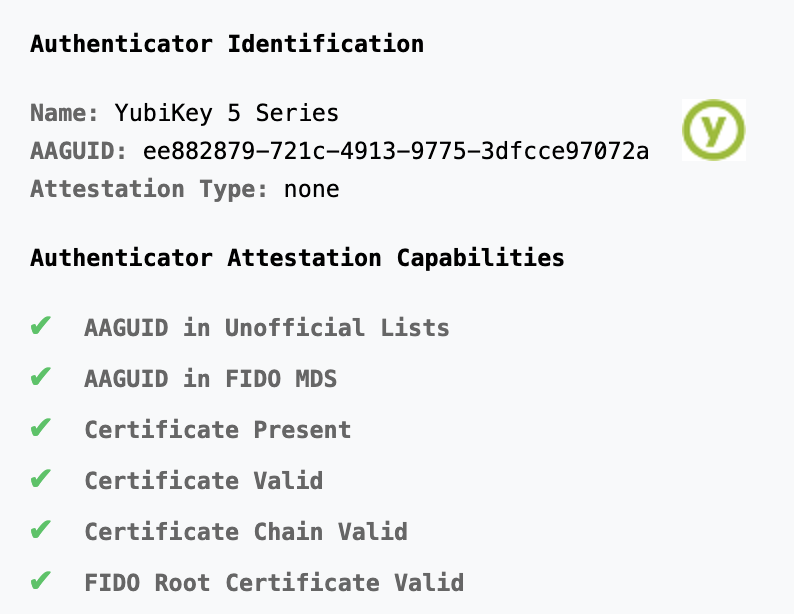
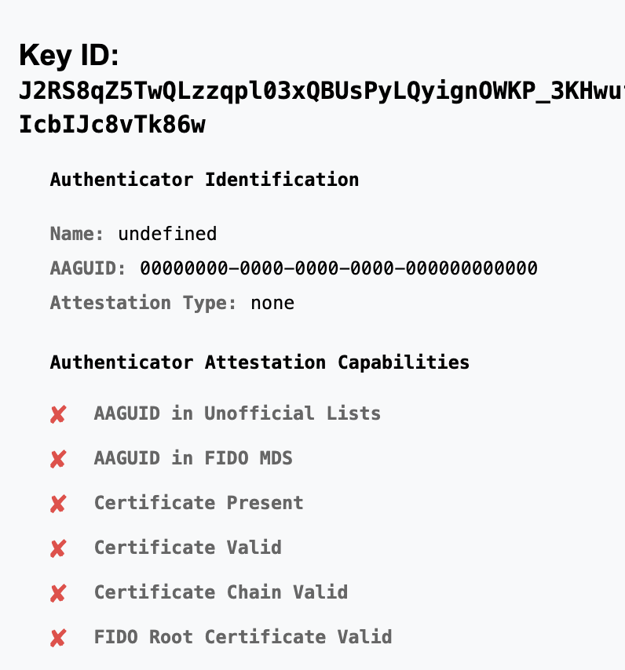

# WebAuthN Authenticator Identification and Verification

This is a simple PoC that shows WebAuthn authenticator metadata.
It shows how to identify and verify authenticators using the AAGUID
and certificate information.

## Checks Against WebAuthN Authenticators

1. AAGUID in community maintained lists
2. AAGUID in FIDO metadata service
3. Certificate Present
4. AAGUID in Certificate
5. Certificate is Valid
6. Cert Chain is Valid
7. Certificate matches FIDO MDS

## Screenshots

### Chrome on Mac

### iCloud Keychain

### 1Password

### YubiKey

### YubiKey Without Attestation

## Resources

- [FIDO Metadata Service](https://fidoalliance.org/metadata/)
- [Passkey AAGUID Explorer](https://passkeydeveloper.github.io/passkey-authenticator-aaguids/explorer/?combined)
- [passkeydeveloper/passkey-authenticator-aaguids](https://github.com/passkeydeveloper/passkey-authenticator-aaguids)
- [YubiKey Hardware FIDO2 AAGUIDs](https://support.yubico.com/hc/en-us/articles/360016648959-YubiKey-Hardware-FIDO2-AAGUIDs)
- [CBOR(Base64(attestationObject))](https://gchq.github.io/CyberChef/#recipe=From_Base64('A-Za-z0-9-_',true,false)CBOR_Decode()) (CyberChef)